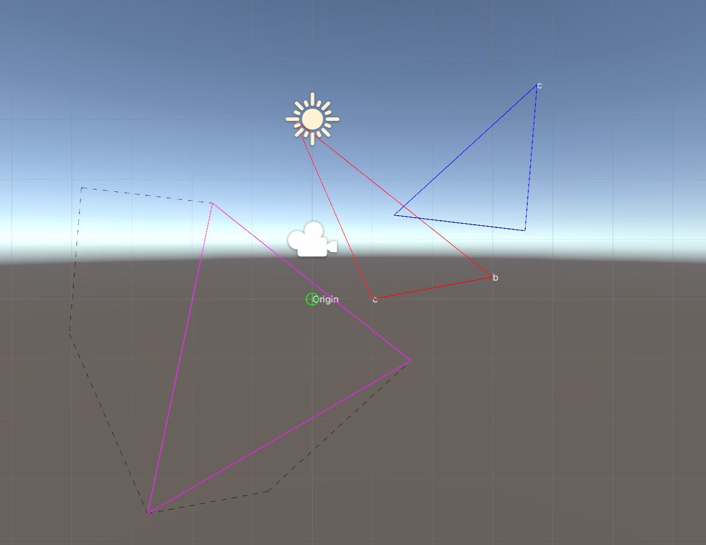
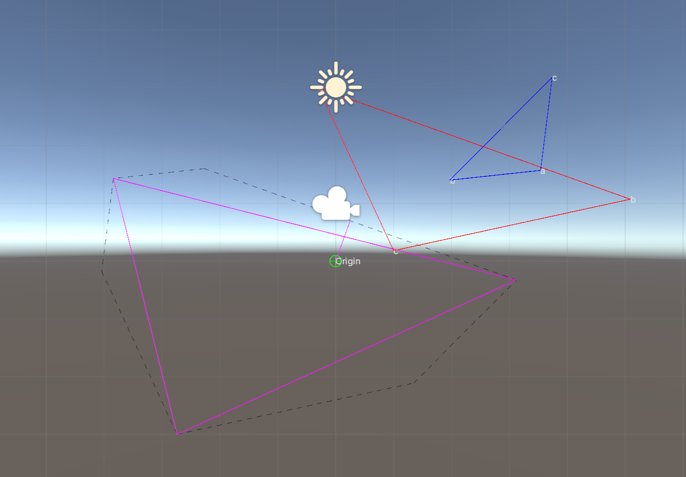

你好，这里是我的帧同步框架

我会逐渐完成一个最简的帧同步，目前很多内容还在制作中。我也是一边学习一边完善。

我的学习和设计记录在这里，欢迎大家的指导：https://github.com/YaoYao-Pig/YaoYaoPigStudyNote/tree/main/%E5%B8%A7%E5%90%8C%E6%AD%A5

## 已完成/已测试

1. 帧同步：[演示视频](./video/LockStep.mkv)
2. 定点数库函数
3. 定点数碰撞系统：[演示视频](./video/CollisionSystem.mkv)

## 已完成/测试中

1. 四叉树空间划分

2. GJK+EPA:可以看我的这个可视化+实现：https://github.com/YaoYao-Pig/GJK-EPA

   碰撞效果：

   

   分离向量：
   
   

## 正在做/已完成设计

1. 帧的预测、回滚和序列化
1. GJK+EPA算法的碰撞系统升级
